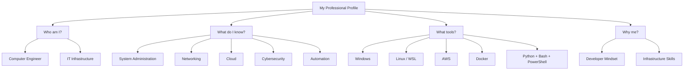

---
For your CV and **self-introduction in IT interviews**, I recommend grouping your skills into **5 main professional domains** instead of listing everything. This makes you sound like an IT Specialist rather than just someone who knows many tools.

Your 5 main topics should be:

---

## 1. System Administration & IT Operations

**(Your core identity)**

Covers:

* Windows Administration
* Linux Administration
* Active Directory
* User & Permission Management
* Group Policy basics
* System Configuration
* Software Installation
* Backup & Recovery
* Performance Monitoring
* Remote Support
* Server Management

**How to say it:**

> "My main area is System Administration, including Windows and Linux environments, user management, system configuration, troubleshooting, and IT operations."

---

## 2. Network Administration & Infrastructure

Covers:

* TCP/IP
* DNS
* DHCP
* LAN/WAN
* Routing & Switching
* VLANs
* Subnetting
* VPN
* Network Troubleshooting
* Network Security Basics

**How to say it:**

> "I also have experience with Network Administration, including TCP/IP, DNS, DHCP, LAN/WAN, troubleshooting, and basic network security."

---

## 3. Cybersecurity & System Security

Covers:

* Access Control
* Authentication & Authorization
* Identity Management
* Least Privilege
* System Hardening
* Vulnerability Awareness
* Encryption Basics
* Incident Response Fundamentals
* Security Monitoring

**How to say it:**

> "I have cybersecurity fundamentals with focus on securing systems through access control, hardening, authentication, and security best practices."

---

## 4. Cloud Infrastructure & Virtualization

Covers:

* AWS Fundamentals
* EC2
* S3
* IAM
* Lambda
* ECR
* Docker
* Virtual Machines
* Cloud Operations

**How to say it:**

> "I have knowledge of cloud infrastructure, especially AWS services, virtualization, and containerization using Docker."

---

## 5. Automation & Technical Support

Covers:

* PowerShell
* Bash
* Python scripting
* Task Automation
* IT Support
* Hardware Troubleshooting
* Ticketing Systems
* Root Cause Analysis
* Documentation

**How to say it:**

> "I use scripting and automation with Python, PowerShell, and Bash to improve IT operations, and I have experience in technical support and troubleshooting."

---

# Best Self-Introduction Version (30–45 seconds)

You can say:

> "I am Osama Gharib, a Computer Engineering graduate specialized in IT Infrastructure, System Administration, and Cloud Technologies. My main areas of expertise include System Administration, Network Administration, Cybersecurity Fundamentals, Cloud Infrastructure, and Automation. I have practical experience working with Windows and Linux environments, including Linux through WSL, system configuration, networking concepts, cloud services, Docker, and infrastructure automation. With my software engineering background, I also leverage Python, Bash, and PowerShell scripting to automate tasks, improve workflows, and build efficient IT solutions. I am passionate about designing, maintaining, and securing reliable IT environments by combining system administration knowledge, cloud technologies, automation, and software development practices."

---

## Your Professional Identity (Recommended)

Instead of:

> System Administrator | IT Infrastructure | Network Administration | Technical Support

I would make it:

> **System Administrator | IT Infrastructure | Network & Cloud Administration | Cybersecurity Fundamentals**

Because this matches your skills and sounds more like an enterprise IT profile.

Your strongest hierarchy is:

1. **System Administration** ⭐⭐⭐⭐⭐
2. **Network Administration** ⭐⭐⭐⭐⭐
3. **Cybersecurity Fundamentals** ⭐⭐⭐⭐
4. **Cloud Infrastructure** ⭐⭐⭐⭐
5. **Automation & IT Support** ⭐⭐⭐⭐

This positioning fits **Junior System Administrator, IT Specialist, Infrastructure Engineer, and IT Support Engineer** roles.
