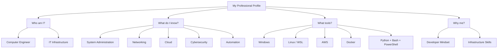

> [Text Form]
```text
                 Osama Gharib
                      |
 ------------------------------------------------
 |                 |              |              |
Who am I?     What I know?   What tools?    Why me?
 |                 |              |              |
Computer       Systems        Windows       Developer
Engineer       Networks       Linux         Mindset
IT Infra       Cloud          AWS           Infra Skills
               Security       Docker
               Automation     Python/Bash/PS
```


---
For an **IT Specialist / IT Support Specialist / System Administrator Junior** interview, these are the **top 20 most common technical questions with professional answers**. They cover the areas interviewers usually focus on: **Windows, Networking, Troubleshooting, Security, Cloud, and Infrastructure**.

---

# Top 20 IT Specialist Technical Interview Q&A

---

## 1. Tell me about your experience in IT support.

**Answer:**

I have experience in troubleshooting hardware and software issues, managing Windows systems, supporting users, configuring networks, handling user accounts and permissions, and performing system maintenance.

I am familiar with:

* Windows Administration
* Linux basics
* TCP/IP networking
* Active Directory concepts
* Hardware troubleshooting
* Backup and security fundamentals
* Remote support tools

My approach is always to identify the root cause, solve the issue, and document the solution.

---

# Windows Administration

---

## 2. What is Active Directory?

**Answer:**

Active Directory is Microsoft's directory service used in enterprise environments to centrally manage:

* Users
* Computers
* Groups
* Permissions
* Policies

It provides authentication and authorization through a domain environment.

Example:

A company can create one user account in Active Directory and allow that employee to access multiple company resources.

---

## 3. What is the difference between Authentication and Authorization?

**Answer:**

**Authentication:**

Verifies the identity of the user.

Example:

```
Username + Password
```

**Authorization:**

Defines what the authenticated user can access.

Example:

```
User can access Finance folder
```

---

## 4. What is Group Policy?

**Answer:**

Group Policy is a Windows feature used to centrally manage computer and user settings in Active Directory.

Examples:

* Password policies
* Software installation
* USB restrictions
* Security configurations
* Desktop settings

Command:

```powershell
gpupdate /force
```

---

## 5. How do you troubleshoot a slow computer?

**Answer:**

I follow these steps:

1. Check CPU, RAM, and Disk usage

Tool:

```
Task Manager
```

2. Check startup applications

3. Check available disk space

4. Scan for malware

5. Check Windows updates

6. Review event logs

7. Optimize or upgrade hardware if needed

---

# Networking

---

## 6. Explain the difference between IP address and MAC address.

**Answer:**

**IP Address:**

Logical address used for communication between networks.

Example:

```
192.168.1.20
```

**MAC Address:**

Physical hardware address assigned to the network card.

Example:

```
00-1A-2B-3C-4D
```

---

## 7. What happens when a user opens a website?

**Answer:**

The process:

1. User enters domain name

Example:

```
google.com
```

2. DNS resolves the domain to an IP address

3. Browser creates TCP connection

4. HTTPS encryption starts

5. HTTP request is sent

6. Server responds with webpage data

---

## 8. What is DNS?

**Answer:**

DNS (Domain Name System) translates domain names into IP addresses.

Example:

```
www.example.com

↓

93.184.216.34
```

Without DNS, users would need to remember IP addresses.

---

## 9. What is DHCP?

**Answer:**

DHCP automatically provides network configuration to devices:

* IP address
* Subnet mask
* Default gateway
* DNS server

Example:

When connecting a laptop to WiFi, DHCP automatically assigns an IP.

---

## 10. How do you troubleshoot network problems?

**Answer:**

My troubleshooting steps:

1. Check physical connection

2. Check IP configuration:

Windows:

```cmd
ipconfig
```

3. Test connectivity:

```cmd
ping 8.8.8.8
```

4. Test DNS:

```cmd
nslookup google.com
```

5. Check route:

```cmd
tracert google.com
```

6. Check firewall and network settings

---

# Linux Administration

---

## 11. What Linux commands do you know?

**Answer:**

Common administration commands:

| Command   | Purpose            |
| --------- | ------------------ |
| ls        | List files         |
| cd        | Change directory   |
| pwd       | Current location   |
| chmod     | Change permissions |
| systemctl | Manage services    |
| df -h     | Disk usage         |
| top       | Process monitoring |
| grep      | Search text        |

---

## 12. Explain Linux file permissions.

**Answer:**

Linux permissions control:

* Owner
* Group
* Others

Example:

```
-rwxr-xr--
```

Meaning:

Owner:

```
rwx
```

Group:

```
r-x
```

Others:

```
r--
```

---

# Security

---

## 13. What is the principle of least privilege?

**Answer:**

Users should receive only the minimum permissions required to perform their tasks.

Example:

A normal employee should not have administrator privileges.

Benefits:

* Reduces security risks
* Limits damage from compromised accounts

---

## 14. What is a firewall?

**Answer:**

A firewall controls incoming and outgoing network traffic based on security rules.

It can:

* Allow traffic
* Block traffic
* Filter ports
* Protect systems

Example:

Allow:

```
HTTPS Port 443
```

Block:

```
Unknown connections
```

---

## 15. Difference between Encryption and Hashing?

**Answer:**

### Encryption:

* Reversible
* Uses a key

Example:

HTTPS communication

### Hashing:

* One-way process
* Cannot normally be reversed

Example:

Password storage

---

# Hardware & Troubleshooting

---

## 16. A computer does not turn on. What do you check?

**Answer:**

I check:

1. Power cable
2. Power supply
3. Monitor connection
4. Hardware indicators
5. RAM seating
6. Motherboard errors
7. BIOS messages

I isolate the issue step-by-step.

---

## 17. Printer is not working. How do you troubleshoot?

**Answer:**

Steps:

1. Check power and cables

2. Check printer status

3. Verify network connection

4. Check printer drivers

5. Clear print queue

6. Restart Print Spooler service

Command:

```powershell
Restart-Service Spooler
```

---

# Cloud & Virtualization

---

## 18. What is virtualization?

**Answer:**

Virtualization creates virtual versions of physical resources.

Examples:

* Virtual servers
* Virtual networks
* Virtual storage

Technologies:

* VMware
* Hyper-V
* VirtualBox

Benefits:

* Lower cost
* Better resource utilization
* Easy backup and recovery

---

## 19. What is cloud computing?

**Answer:**

Cloud computing provides IT resources over the internet.

Examples:

* Virtual machines
* Storage
* Databases
* Networking

Examples:

* AWS
* Microsoft Azure
* Google Cloud

Benefits:

* Scalability
* High availability
* Pay-as-you-use model

---

# Scenario Question

---

## 20. A user cannot login to their computer. How do you troubleshoot?

**Answer:**

I follow these steps:

1. Verify username and password

2. Check if account is locked

3. Check network connection to domain

4. Verify Active Directory status

5. Reset password if required

6. Check Event Viewer logs

7. Confirm user permissions

---

# IT Specialist Interview Priority Order

For your CV, focus on:

1. ⭐ Windows + Active Directory
2. ⭐ TCP/IP + DNS + DHCP
3. ⭐ Troubleshooting scenarios
4. ⭐ PowerShell commands
5. ⭐ Linux basics
6. ⭐ Security fundamentals
7. ⭐ Backup and Recovery
8. ⭐ Cloud basics (AWS/Azure)

These 20 questions represent the **highest-frequency questions for Junior IT Specialist, IT Support Engineer, and System Administrator interviews**.


---

I created **50 technical interview Q&A** based on your CV skills for **System Administrator / IT Infrastructure / Network Administration / Technical Support** roles. The questions are grouped by topic and written in an HR + technical interview style.

---

# 1. Windows Administration (1–8)

### Q1: What is Windows Server and how is it different from Windows Desktop?

**A:**
Windows Server is Microsoft's operating system designed for enterprise environments. It provides services like Active Directory, DNS, DHCP, file sharing, virtualization, and remote management. Windows Desktop is designed for end users and daily productivity.

---

### Q2: What is Active Directory (AD)?

**A:**
Active Directory is Microsoft's directory service used to manage users, computers, groups, and resources in a domain environment. It provides centralized authentication and authorization.

---

### Q3: Explain the difference between Authentication and Authorization.

**A:**

* Authentication: Verifies who the user is (username/password, MFA).
* Authorization: Determines what resources the user can access after authentication.

Example:
A user logs into the domain (authentication) and receives permission to access a shared folder (authorization).

---

### Q4: What are Organizational Units (OUs) in Active Directory?

**A:**
OUs are containers used to organize users, computers, and groups inside Active Directory. They allow administrators to apply Group Policies and delegate permissions.

---

### Q5: What is Group Policy?

**A:**
Group Policy is a Windows feature used to centrally configure security settings, software installation, passwords, desktop restrictions, and user policies across computers in a domain.

---

### Q6: How do you create a new user in Active Directory?

**A:**
Using:

* Active Directory Users and Computers (GUI)
* PowerShell:

```powershell
New-ADUser -Name "Ahmed"
```

Then assign groups and permissions.

---

### Q7: What is NTFS permission?

**A:**
NTFS permissions control access to files and folders in Windows. They include:

* Full Control
* Modify
* Read & Execute
* Read
* Write

---

### Q8: Difference between NTFS and FAT32?

**A:**

| NTFS                    | FAT32                             |
| ----------------------- | --------------------------------- |
| Supports permissions    | No permissions                    |
| Large files             | Maximum 4GB file size             |
| Journaling              | No journaling                     |
| Used in Windows systems | Used in USB/storage compatibility |

---

# 2. Linux Administration (9–16)

### Q9: What is Linux?

**A:**
Linux is an open-source operating system widely used for servers, cloud infrastructure, networking devices, and development environments.

---

### Q10: Difference between Linux root user and normal user?

**A:**
Root has full system privileges, while normal users have limited permissions.

Example:

```bash
sudo apt update
```

allows temporary administrative privileges.

---

### Q11: Explain Linux file permissions.

**A:**

Example:

```
-rwxr-xr--
```

Means:

Owner:

```
rwx
```

Group:

```
r-x
```

Others:

```
r--
```

---

### Q12: How do you change file permissions?

**A:**

Using chmod:

```bash
chmod 755 script.sh
```

Meaning:

Owner:
rwx

Group:
rx

Others:
rx

---

### Q13: Difference between hard link and symbolic link?

**A:**

Hard link:

* Points directly to inode
* Same filesystem
* Survives original deletion

Symbolic link:

* Shortcut/reference to another file
* Can point to another filesystem

Example:

```bash
ln file.txt hardlink

ln -s file.txt softlink
```

---

### Q14: How do you check running processes in Linux?

**A:**

```bash
ps aux
```

or

```bash
top
```

or

```bash
htop
```

---

### Q15: How do you check disk usage?

**A:**

```bash
df -h
```

For folders:

```bash
du -sh folder/
```

---

### Q16: How do you manage Linux services?

**A:**

Using systemd:

```bash
systemctl status nginx

systemctl restart nginx
```

---

# 3. Networking (17–28)

### Q17: Explain TCP/IP model.

**A:**

Four layers:

1. Application
2. Transport
3. Internet
4. Network Access

It defines how devices communicate over networks.

---

### Q18: What is an IP address?

**A:**

An IP address identifies a device on a network.

Example:

```
192.168.1.10
```

---

### Q19: Difference between IPv4 and IPv6?

**A:**

IPv4:

```
32-bit
192.168.1.1
```

IPv6:

```
128-bit
2001:db8::1
```

IPv6 provides a much larger address space.

---

### Q20: What is subnetting?

**A:**

Subnetting divides a large network into smaller networks to improve performance and security.

Example:

```
192.168.1.0/24
```

contains:

256 addresses.

---

### Q21: What is DNS?

**A:**

DNS converts domain names into IP addresses.

Example:

```
google.com → 142.x.x.x
```

---

### Q22: What is DHCP?

**A:**

DHCP automatically assigns:

* IP address
* Subnet mask
* Gateway
* DNS server

to clients.

---

### Q23: Difference between Hub, Switch, and Router?

**A:**

Hub:

* Broadcasts everywhere

Switch:

* Connects devices in LAN using MAC addresses

Router:

* Connects different networks using IP addresses

---

### Q24: What is VLAN?

**A:**

VLAN logically separates networks on the same physical switch.

Example:

* VLAN 10 → HR
* VLAN 20 → IT

---

### Q25: What is a VPN?

**A:**

VPN creates a secure encrypted connection between users and networks.

Used for:

* Remote access
* Secure communication

---

### Q26: How do you troubleshoot network issues?

**A:**

Steps:

1. Check physical connection
2. Check IP configuration

```
ipconfig
```

3. Test connectivity:

```
ping
```

4. Check DNS:

```
nslookup
```

5. Check routes:

```
tracert
```

---

### Q27: What is MAC address?

**A:**

A MAC address is a unique hardware address assigned to a network interface card.

Example:

```
00-AA-BB-CC-DD
```

---

### Q28: Difference between LAN and WAN?

**A:**

LAN:

* Local network
* Small area

WAN:

* Large geographical area
* Connects multiple LANs

---

# 4. Cloud & Virtualization (29–36)

### Q29: What is Cloud Computing?

**A:**

Cloud computing provides computing resources over the internet such as:

* Servers
* Storage
* Databases
* Networking

---

### Q30: Explain AWS EC2.

**A:**

EC2 provides virtual servers in AWS cloud.

You can configure:

* CPU
* RAM
* Storage
* Operating system

---

### Q31: What is AWS S3?

**A:**

S3 is object storage used for:

* Backups
* Static websites
* Data storage

---

### Q32: What is IAM in AWS?

**A:**

Identity and Access Management controls:

* Users
* Roles
* Permissions

---

### Q33: What is Docker?

**A:**

Docker is a containerization platform that packages applications with dependencies into containers.

---

### Q34: Difference between Virtual Machine and Container?

**A:**

VM:

* Includes full operating system

Container:

* Shares host OS kernel
* Lightweight

---

### Q35: What is virtualization?

**A:**

Virtualization creates virtual versions of:

* Servers
* Storage
* Networks

Examples:

* VMware
* Hyper-V

---

### Q36: Why use cloud infrastructure?

**A:**

Benefits:

* Scalability
* High availability
* Cost optimization
* Faster deployment

---

# 5. Cybersecurity (37–42)

### Q37: What is the principle of least privilege?

**A:**

Users should receive only the minimum permissions required to perform their tasks.

---

### Q38: Difference between Encryption and Hashing?

**A:**

Encryption:

* Reversible with key

Hashing:

* One-way transformation

Example:
Passwords are stored using hashing.

---

### Q39: What is system hardening?

**A:**

System hardening reduces security risks by:

* Removing unnecessary services
* Updating systems
* Configuring firewalls
* Applying security policies

---

### Q40: What is a firewall?

**A:**

A firewall controls network traffic based on security rules.

---

### Q41: What is vulnerability?

**A:**

A weakness in software, hardware, or configuration that attackers can exploit.

---

### Q42: Explain incident response.

**A:**

Steps:

1. Identification
2. Containment
3. Eradication
4. Recovery
5. Lessons learned

---

# 6. IT Support & Troubleshooting (43–50)

### Q43: A user cannot access the internet. How do you troubleshoot?

**A:**

Check:

1. Cable/WiFi
2. IP address
3. Gateway
4. DNS
5. Router connection

Commands:

```
ipconfig
ping
nslookup
```

---

### Q44: Computer is slow. What do you check?

**A:**

* CPU usage
* RAM usage
* Disk space
* Startup applications
* Malware
* Updates

Tools:

Task Manager

---

### Q45: What is Remote Desktop (RDP)?

**A:**

RDP allows administrators to remotely connect and manage Windows machines.

---

### Q46: What is SSH?

**A:**

SSH is a secure protocol used to remotely access Linux servers.

Example:

```bash
ssh user@server_ip
```

---

### Q47: Explain backup types.

**A:**

Full Backup:

* Everything

Incremental:

* Changes since last backup

Differential:

* Changes since last full backup

---

### Q48: What is RAID?

**A:**

RAID combines multiple disks for:

* Performance
* Redundancy

Examples:

RAID 0:
Performance

RAID 1:
Mirroring

---

### Q49: What is ticketing system?

**A:**

A system used to manage IT incidents and requests.

Examples:

* ServiceNow
* Jira Service Management

---

### Q50: How do you document IT problems?

**A:**

I document:

* Issue description
* Symptoms
* Root cause
* Solution
* Preventive actions

Documentation improves future troubleshooting.

---

## Recommended Interview Practice Order for Your CV

1. Windows + Active Directory
2. Networking TCP/IP + DNS + DHCP
3. Linux commands
4. Troubleshooting scenarios
5. AWS fundamentals
6. Cybersecurity basics
7. PowerShell/Bash automation

These 50 questions cover around **80–90% of junior System Administrator / IT Support interviews**.

---

Yes. I will extend it with **50 additional technical interview Q&A (51–100)** focusing on **Junior System Administrator / IT Infrastructure / Network Administrator / Technical Support** interviews. I will add more **real-world scenario questions**, PowerShell, Active Directory, Windows troubleshooting, networking, security, backup, monitoring, and enterprise concepts.

---

# 7. Windows Server Advanced Administration (51–60)

---

### Q51: What is Active Directory Domain Services (AD DS)?

**A:**

AD DS is the core Active Directory service that stores information about:

* Users
* Computers
* Groups
* Policies
* Network resources

It provides centralized authentication and management in enterprise networks.

---

### Q52: What is a Domain Controller?

**A:**

A Domain Controller (DC) is a Windows Server that hosts Active Directory services.

Responsibilities:

* User authentication
* Password validation
* Group Policy processing
* Directory database management

Example:

```
DC01.company.local
```

---

### Q53: What is the difference between Workgroup and Domain?

**A:**

| Workgroup            | Domain                  |
| -------------------- | ----------------------- |
| Peer-to-peer network | Centralized management  |
| Local accounts       | Domain accounts         |
| Small environments   | Enterprise environments |
| No central policies  | Group Policy available  |

---

### Q54: What is DNS Forward Lookup and Reverse Lookup?

**A:**

Forward Lookup:

Converts hostname → IP

Example:

```
server01.company.com → 192.168.1.10
```

Reverse Lookup:

Converts IP → hostname

Example:

```
192.168.1.10 → server01.company.com
```

---

### Q55: Why is DNS important in Active Directory?

**A:**

Active Directory depends heavily on DNS for locating:

* Domain Controllers
* Kerberos services
* LDAP services

Without proper DNS, domain authentication can fail.

---

### Q56: What is FSMO Role in Active Directory?

**A:**

FSMO (Flexible Single Master Operations) are five special roles:

1. Schema Master
2. Domain Naming Master
3. RID Master
4. PDC Emulator
5. Infrastructure Master

They prevent conflicts in AD operations.

---

### Q57: What is Group Policy inheritance?

**A:**

Group Policies are applied based on hierarchy:

```
Local Policy
     ↓
Site
     ↓
Domain
     ↓
OU
```

Policies closer to the object usually have higher priority.

---

### Q58: How do you force Group Policy update?

**A:**

Command:

```powershell
gpupdate /force
```

To check applied policies:

```powershell
gpresult /r
```

---

### Q59: How do you check Windows Event Logs?

**A:**

Using:

GUI:

```
Event Viewer
```

PowerShell:

```powershell
Get-WinEvent -LogName System
```

Common logs:

* Application
* Security
* System

---

### Q60: What is Windows Registry?

**A:**

Registry is a database that stores Windows configuration settings.

Examples:

* User settings
* Hardware configuration
* Installed software settings

Tool:

```
regedit
```

---

# 8. PowerShell Administration (61–68)

---

### Q61: What is PowerShell?

**A:**

PowerShell is Microsoft's command-line shell and scripting language used for:

* Automation
* Administration
* System management

---

### Q62: Difference between CMD and PowerShell?

**A:**

| CMD              | PowerShell           |
| ---------------- | -------------------- |
| Text output      | Object-based output  |
| Limited commands | Thousands of cmdlets |
| Basic automation | Advanced scripting   |

---

### Q63: How do you list running services using PowerShell?

**A:**

```powershell
Get-Service
```

Filter:

```powershell
Get-Service | Where-Object {$_.Status -eq "Running"}
```

---

### Q64: How do you check system information?

**A:**

```powershell
Get-ComputerInfo
```

or:

```powershell
systeminfo
```

---

### Q65: How do you find installed software?

**A:**

PowerShell:

```powershell
Get-WmiObject Win32_Product
```

or:

```powershell
Get-ItemProperty HKLM:\Software\Microsoft\Windows\CurrentVersion\Uninstall\*
```

---

### Q66: How do you create a local user using PowerShell?

**A:**

```powershell
New-LocalUser -Name "Ahmed"
```

---

### Q67: How do you test network connectivity using PowerShell?

**A:**

```powershell
Test-NetConnection google.com
```

Example:

Check port:

```powershell
Test-NetConnection server01 -Port 443
```

---

### Q68: What is PowerShell Remoting?

**A:**

PowerShell Remoting allows administrators to execute commands on remote computers.

Example:

```powershell
Enter-PSSession Server01
```

---

# 9. Networking Advanced (69–78)

---

### Q69: What happens when you type google.com in your browser?

**A:**

Process:

1. Browser checks cache
2. DNS resolves domain name
3. TCP connection established
4. TLS encryption starts
5. HTTP request sent
6. Server returns response

---

### Q70: What is ARP?

**A:**

ARP (Address Resolution Protocol) maps:

```
IP address → MAC address
```

Example:

```
192.168.1.20 → AA:BB:CC:DD
```

Command:

Windows:

```cmd
arp -a
```

---

### Q71: What is the default gateway?

**A:**

The default gateway is the router used to communicate with networks outside the local network.

Example:

```
PC → Router → Internet
```

---

### Q72: Difference between Static IP and DHCP?

**A:**

Static IP:

* Manually configured
* Used for servers

DHCP:

* Automatically assigned
* Used for clients

---

### Q73: What are common TCP ports?

**A:**

| Service | Port |
| ------- | ---- |
| HTTP    | 80   |
| HTTPS   | 443  |
| SSH     | 22   |
| RDP     | 3389 |
| DNS     | 53   |
| FTP     | 21   |

---

### Q74: Difference between TCP and UDP?

**A:**

TCP:

* Connection-oriented
* Reliable
* Uses acknowledgments

Example:

HTTP, SSH

UDP:

* Faster
* No guarantee

Example:

DNS, VoIP

---

### Q75: What is NAT?

**A:**

Network Address Translation converts private IP addresses into public IP addresses.

Example:

```
192.168.1.10
       ↓
Public IP
```

---

### Q76: What is Port Forwarding?

**A:**

Port forwarding allows external users to access internal services.

Example:

Internet:

```
PublicIP:443
```

to:

```
Internal Server:443
```

---

### Q77: What is ICMP?

**A:**

ICMP is a protocol used for network diagnostics.

Example:

```cmd
ping
```

uses ICMP.

---

### Q78: Difference between Broadcast and Unicast?

**A:**

Unicast:

One sender → One receiver

Example:

```
PC → Server
```

Broadcast:

One sender → All devices

Example:

```
DHCP Discovery
```

---

# 10. Storage, Backup and Recovery (79–86)

---

### Q79: What is a file system?

**A:**

A file system organizes and manages data on storage devices.

Examples:

Windows:

* NTFS
* ReFS

Linux:

* EXT4
* XFS

---

### Q80: Difference between NTFS permissions and Share permissions?

**A:**

NTFS:

Controls local and network access.

Share:

Only applies over network.

Effective permission:

```
Most restrictive permission wins
```

---

### Q81: What is Volume Shadow Copy?

**A:**

Windows feature that creates snapshots of files.

Used for:

* File recovery
* Previous versions

---

### Q82: What is Disaster Recovery?

**A:**

Disaster Recovery is the process of restoring IT systems after failures.

Includes:

* Backups
* Recovery plans
* Alternative infrastructure

---

### Q83: Difference between RPO and RTO?

**A:**

RPO:

Recovery Point Objective

"How much data can we lose?"

Example:

1 hour

---

RTO:

Recovery Time Objective

"How fast must service return?"

Example:

2 hours

---

### Q84: What is RAID 5?

**A:**

RAID 5 provides:

* Disk performance
* Fault tolerance

Requires:

Minimum 3 disks

Uses:

Parity information

---

### Q85: What is NAS?

**A:**

Network Attached Storage provides shared storage over a network.

Used for:

* File sharing
* Backup

---

### Q86: What is SAN?

**A:**

Storage Area Network provides high-speed block storage.

Common in:

* Data centers
* Enterprise environments

---

# 11. Security and Monitoring (87–100)

---

### Q87: What is MFA?

**A:**

Multi-Factor Authentication requires multiple verification methods.

Example:

Password + Mobile Code

---

### Q88: What is Kerberos?

**A:**

Kerberos is an authentication protocol used by Active Directory.

It uses:

* Tickets
* Encryption
* Trusted authentication

---

### Q89: What is LDAP?

**A:**

LDAP is a protocol used to access and manage directory services.

Example:

Active Directory uses LDAP.

---

### Q90: What is SIEM?

**A:**

Security Information and Event Management collects and analyzes security logs.

Examples:

* Splunk
* Microsoft Sentinel

---

### Q91: What is antivirus vs EDR?

**A:**

Antivirus:

Detects known malware.

EDR:

Provides:

* Endpoint monitoring
* Threat detection
* Investigation

---

### Q92: What is patch management?

**A:**

Patch management is the process of:

* Testing updates
* Installing security fixes
* Maintaining systems

---

### Q93: What is a vulnerability scan?

**A:**

A vulnerability scan identifies security weaknesses.

Examples:

* Missing patches
* Weak configurations

---

### Q94: What is a brute force attack?

**A:**

An attacker tries many passwords until finding the correct one.

Protection:

* MFA
* Account lockout
* Strong passwords

---

### Q95: What is phishing?

**A:**

Phishing is a social engineering attack where attackers trick users into revealing information.

---

### Q96: What is Zero Trust Security?

**A:**

Zero Trust means:

"Never trust, always verify"

Every request must be authenticated and authorized.

---

### Q97: What monitoring tools have you used?

**A:**

Examples:

* Windows Event Viewer
* Task Manager
* Performance Monitor
* Zabbix
* Nagios
* Grafana

---

### Q98: What performance counters do you monitor?

**A:**

Common metrics:

CPU:

```
% Processor Time
```

Memory:

```
Available RAM
```

Disk:

```
Disk latency
```

Network:

```
Bandwidth usage
```

---

### Q99: A server is down. What steps do you follow?

**A:**

1. Confirm outage
2. Check physical connectivity
3. Check power status
4. Check ping
5. Check services
6. Review logs
7. Restore service
8. Document incident

---

### Q100: Explain your troubleshooting methodology.

**A:**

I follow a structured approach:

1. Identify the problem
2. Collect information
3. Create possible causes
4. Test solutions
5. Implement fix
6. Verify results
7. Document solution

---

## Final Interview Coverage After 100 Questions

Your preparation now covers:

✅ Windows Server
✅ Active Directory
✅ Group Policy
✅ DNS/DHCP
✅ PowerShell
✅ Linux Administration
✅ TCP/IP Networking
✅ Cisco Fundamentals
✅ AWS Basics
✅ Docker & Virtualization
✅ Cybersecurity Fundamentals
✅ Backup & Recovery
✅ IT Support Scenarios
✅ Troubleshooting Methodology

For a **Junior System Administrator / IT Support Engineer**, these 100 questions cover approximately **90–95% of common technical interviews**.

---

